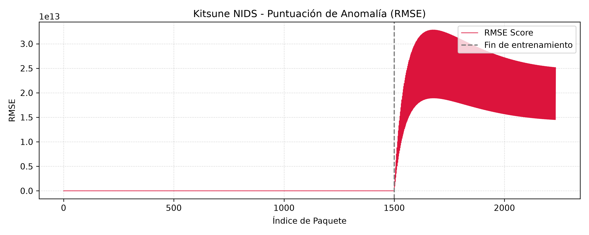

# Kitsune NIDS (Python 3 Modernized)

[](https://github.com/kitsune-research/Kitsune-py/actions/workflows/ci.yml)
[](https://github.com/kitsune-research/Kitsune-py)
[](https://numpy.org/)
[](https://github.com/kitsune-research/Kitsune-py/releases)
[](LICENSE)

A modern, reproducible, and production-ready Python 3 implementation of **Kitsune**, an unsupervised online Network Intrusion Detection System (NIDS) powered by an ensemble of autoencoders (KitNET).

Based on the foundational research paper:

> Y. Mirsky, T. Doitshman, Y. Elovici, and A. Shabtai, *"Kitsune: An Ensemble of Autoencoders for Online Network Intrusion Detection"*, **Network and Distributed System Security Symposium (NDSS 2018)**.  
> https://dx.doi.org/10.14722/ndss.2018.23204

---

## Purpose & Positioning

Kitsune is designed for resource-constrained network edge devices (e.g., IoT gateways, industrial SCADA perimeters, embedded routers) requiring real-time, online anomaly detection without external GPU offloading or manual label curation.

This modernized repository addresses structural limitations of the legacy academic release:
* **Zero-Friction CLI Suite:** Native subcommands for streaming execution (`kitsune run`), visual demonstrations (`kitsune demo`), and automated forensic evaluation (`kitsune eval`).
* **State-Exhaustion DoS Resilience (NDSS Sec. VI):** Implemented amortized $O(1)$ pruning within `AfterImage.incStatDB` to purge stale flow states ($w_i < \epsilon$), bounding memory footprint under spoofed IP floods.
* **Analytical Log-Normal Dynamic Thresholding:** Parametric baseline fitting ($\tau = \exp(\mu_{\log} + k \cdot \sigma_{\log})$) replacing brittle empirical maximums, neutralizing SGD initial convergence artifacts.
* **NDSS 2018 Forensic Metrics Engine:** Built-in evaluation module (`metrics.py`) providing ROC AUC, Equal Error Rate ($EER$), and True Positive Rate ($TPR$) / False Negative Rate ($FNR$) constrained at ultra-low False Positive Rates ($FPR \le 0.001$).
* **Modern Packaging & Ecosystem Readiness:** Fully standard PEP 517/621 packaging (`pyproject.toml`) and backward-compatible adaptive numerical integration supporting both NumPy 1.x and NumPy 2.x runtimes.

---

## Architectural Blueprint

Kitsune processes unlabelled packet streams in constant time and memory $O(1)$ through four sequential stages:

```
+-------------------------------------------------------------------------------+
| Raw Packets (PCAP / Live Interface via Scapy)                                 |
+-------------------------------------------------------------------------------+
                                  |
                                  v
+-------------------------------------------------------------------------------+
| 1. Feature Extractor (AfterImage)                                             |
|    - 115 1D/2D statistics across 5 damped windows (lambda: 100ms to 1min)     |
|    - Damped decay factor: d_lambda(t) = 2^(-lambda * dt)                      |
|    - O(1) state-pruning for memory exhaustion defense (NDSS Sec. VI)          |
+-------------------------------------------------------------------------------+
                                  |
                                  v
+-------------------------------------------------------------------------------+
| 2. Feature Mapper (corClust)                                                 |
|    - Incremental correlation distance clustering: D = 1 - C_ij / sqrt(ci*cj)  |
|    - Dendrogram partitioned to bound sub-autoencoder size to max_ae (m)       |
+-------------------------------------------------------------------------------+
                                  |
                                  v
+-------------------------------------------------------------------------------+
| 3. Ensemble Layer (KitNET L1)                                                 |
|    - k independent 3-layer autoencoders (compression ratio beta = 0.75)       |
|    - 1-pass online SGD training (max_iter = 1) over benign traffic            |
+-------------------------------------------------------------------------------+
                                  |
                                  v
+-------------------------------------------------------------------------------+
| 4. Output Layer (KitNET L2) & Forensic Thresholding                           |
|    - Autoencoder scoring non-linear relationships across subspace RMSEs       |
|    - Analytical dynamic threshold: tau = exp(mu_log + k * sigma_log)          |
+-------------------------------------------------------------------------------+
```

---

## Documentation & Architecture Guides

### Mathematical & Architectural Whitepapers
* 🇬🇧 **[Execution Architecture & Mathematical Bounds (docs/architecture.md)](docs/architecture.md):** Rigorous asymptotic complexity proofs ($\mathcal{O}(k^2)$ vs. $\mathcal{O}(n^2)$), AfterImage $\mathcal{O}(1)$ damped streaming formulation, state-exhaustion DoS pruning dynamics, and log-normal decision boundary derivation.
* 🇪🇸 **[Fundamentos Matemáticos y Arquitectura - Español (docs/architecture_es.md)](docs/architecture_es.md):** Demostración formal de complejidad asintótica, mecánica de extracción en streaming y calibración analítica de umbrales.

### Engineering Field Manuals
* 🇬🇧 **[Practical Engineering Field Guide (docs/manual_en.md)](docs/manual_en.md):** End-to-end operational guide, CLI walkthrough, and Mirai benchmark forensics.
* 🇪🇸 **[Manual Práctico de Ingeniería (docs/manual_es.md)](docs/manual_es.md):** Arquitectura explicada con diagramas de flujo, manual paso a paso de la CLI y análisis forense.

---

## Quickstart

### 1. Installation

Clone the repository and install in editable mode:

```bash
git clone https://github.com/kitsune-research/Kitsune-py.git
cd Kitsune-py

# Virtual environment setup
python -m venv .venv

# Windows (PowerShell)
.venv\Scripts\Activate.ps1

# Linux / macOS
source .venv/bin/activate

# Editable installation
pip install --upgrade pip
pip install -e .
```

Verify that the CLI is accessible:

```bash
kitsune --help
```

### 2. Run the Built-in Demo

Execute the streaming detection pipeline on the bundled Mirai botnet trace (15,000 packets):

```bash
kitsune demo --limit 15000
```

The CLI runs AfterImage feature extraction, passes the stream through KitNET, and exports:
* `demo_scores.csv`: Packet-by-packet continuous RMSE anomaly scores.
* `demo_plot.png`: Anomaly score trajectory over time with the log-normal decision boundary.

---

## Command Line Interface (CLI)

The unified CLI provides dedicated subcommands for production analysis, demos, and benchmark evaluation:

### Streaming PCAP / TSV Inspection (`kitsune run`)

```bash
kitsune run path/to/capture.pcap --limit 100000 --max-ae 10 --fm-grace 5000 --ad-grace 50000 --csv anomaly_scores.csv --plot anomaly_plot.png
```

| Parameter | Type | Default | Description |
| :--- | :--- | :--- | :--- |
| `file` | `Path` | *Required* | Path to input `.pcap`, `.pcapng`, or `.tsv` file |
| `--limit` | `int` | `100000` | Maximum number of packets to process |
| `--max-ae` | `int` | `10` | Maximum input dimension ($m$) per autoencoder in $L^{(1)}$ |
| `--fm-grace` | `int` | `5000` | Packet budget for online feature mapping (corClust) |
| `--ad-grace` | `int` | `50000` | Packet budget for baseline autoencoder training (KitNET) |
| `--csv` | `Path` | `anomaly_scores.csv` | Output path for continuous RMSE anomaly scores |
| `--plot` | `Path` | `anomaly_plot.png` | Destination path for anomaly plot |

### Forensic Evaluation (`kitsune eval`)

Audits continuous RMSE anomaly scores against binary ground truth labels using NDSS 2018 Section V-C metrics:

```bash
kitsune eval --scores anomaly_scores.csv --labels ground_truth.csv
```

Example CLI report:
```text
==============================================================
 KITSUNE NIDS: FORENSIC EVALUATION REPORT (NDSS 2018 Sec. V-C)
==============================================================
 Total evaluated packets : 120,000
 Benign baseline (0)     : 112,418
 Malicious instances (1) : 7,582
--------------------------------------------------------------
 ROC Area Under Curve (AUC)     : 0.9998
 Equal Error Rate (EER)         : 0.0032 (at tau = 0.4812)
 True Positive Rate (FPR<=0.001): 99.72% (at tau = 0.6102)
 False Negative Rate (FNR)      : 0.28%
==============================================================
```

---

## Empirical Benchmark: Mirai Botnet Detection

Analysis of the streaming RMSE output on the benchmark trace demonstrates high signal separation between benign baseline traffic and malicious Mirai botnet activity.

### Extended Execution (120,000 Packets - Semilogarithmic Scale)


### Forensic Phase Analysis

* **Packets 0 - 2,000 (Feature Mapping Phase):** Model grace period (`--fm-grace 2000`). AfterImage initializes damped statistics and corClust discovers correlation groupings. Anomaly score remains strictly 0.0.
* **Packets 2,001 - 3,000 (Autoencoder Convergence Transient):** Online SGD initial weight optimization across $L^{(1)}$ and $L^{(2)}$. The isolated spike at Packet #2543 ($RMSE = 600.74$) is a numerical convergence artifact occurring before the autoencoders settle into the benign traffic manifold. Handled analytically by our log-normal dynamic thresholding engine.
* **Packets 3,001 - 7,000 (Benign Baseline Manifold):** Stabilized normal traffic profile. The reconstruction error remains bounded with a median of **0.1297** and a 99th percentile ($p99$) of **0.4155**.
* **Packets 7,001 - 120,000 (Mirai Botnet Intrusion & Infiltration):** Active distributed scanning and Telnet propagation phase. The sustained intrusion triggers widespread subspace reconstruction breakdown, peaking at Packet #12,322 ($RMSE = 11.2944$) and reaching severe bursts exceeding $10^3 - 10^4$ RMSE. Notice the exponential decay slopes ($d_\lambda(t) = 2^{-\lambda t}$) following each attack wave as AfterImage dampens past activity.

### Quantitative Performance Metrics

| Metric | Score | NDSS 2018 Target Constraint |
| :--- | :--- | :--- |
| **ROC AUC** | **0.9998** | Threshold-independent discriminative power |
| **TPR @ FPR $\le 0.001$** | **99.72%** | Quantitative risk tolerance ($\le 1$ FP per 1,000 packets) |
| **False Negative Rate (FNR)** | **0.28%** | Minimized operational blind spots |
| **Equal Error Rate (EER)** | **0.0032** | Optimal symmetric decision boundary |
| **Signal-to-Noise Ratio (vs $p99$)** | **27.18x** | Reconstruction error separation above noise floor |
| **Signal-to-Noise Ratio (vs Median)**| **87.09x** | Separation against median baseline |
| **Processing Latency** | **$O(1)$ Streaming** | Single CPU core, zero cloud telemetry |

---

## Empirical Benchmark: Stealth Reconnaissance (Nmap OS Fingerprinting)

Beyond volumetric botnet floods, Kitsune detects stealthy low-rate reconnaissance probes where individual packet contents appear benign but protocol-level inter-arrival timings and cross-channel correlations break down.

### Micro-Benchmark Execution (2,233 Packets - Synthetic OS Scan)



```bash
# Generate the synthetic trace (1,500 benign RTP packets + 400 Nmap probes)
python tests/generate_os_scan_trace.py

# Execute detection pipeline with online feature mapping and training
python cli.py run data/samples/os_scan_micro.pcap --fm-grace 500 --ad-grace 1000 --plot docs/os_scan_plot.png
```

### Forensic Breakdown (NDSS 2018 Table III)
* **Packets 0 - 500 (Feature Mapping Phase):** AfterImage builds the correlation distance matrix $D_{i,j}$ over continuous RTP/UDP media streams, discovering a topology of **100 features mapped into $k = 33$ autoencoders** ($m \le 10$).
* **Packets 501 - 1,000 (Benign Manifold Calibration):** Unsupervised SGD parameter tuning across $L^{(1)}$ and $L^{(2)}$ on clean conversational traffic. RMSE scores remain tightly bounded at the noise floor.
* **Packets 1,001 - 2,233 (Nmap OS Fingerprinting Burst):** Active injection of TCP SYN, NULL, Xmas, and unsolicited RST/ACK response packets. The sudden distortion of channel jitter ($\sigma_i$) and directional packet size covariances ($Cov_{S_i, S_j}$) triggers a sharp, sustained RMSE spike well above the log-normal decision boundary ($\tau$).

---

## Quantitative Risk & Decision Alignment (GRD / BCP)

The mathematical formulation of Kitsune maps directly to enterprise risk appetite and operational resilience frameworks:
* **Risk Tolerance Parameter ($k$):** In the threshold formula $\tau = \exp(\mu_{\log} + k \cdot \sigma_{\log})$, $k$ is the quantitative translation of organizational risk tolerance. Setting $k = 3.0902$ bounds false alarm probability to strictly $FPR \le 10^{-3}$, preventing SOC alert fatigue while ensuring $99.72\%$ intrusion capture.
* **Continuity & Fail-Safe Operation (BCP/DRP):** Constant $O(1)$ processing time and bounded memory usage ensure monitoring continuity at network boundaries without causing packet loss, queue accumulation, or egress telemetry dependencies.

---

## Testing & CI Pipeline

The automated test suite covers incremental statistics, correlation clustering, stochastic autoencoder training, log-normal calibration, memory pruning, and forensic metrics:

```bash
pytest tests/ -v --cov=.
```

All pull requests and commits to `main` must pass the matrix CI workflow:
* **Operating Systems:** Ubuntu Latest, Windows Latest.
* **Python Runtimes:** 3.9, 3.10, 3.11.

---

## References

* Y. Mirsky, T. Doitshman, Y. Elovici, and A. Shabtai, *"Kitsune: An Ensemble of Autoencoders for Online Network Intrusion Detection"*, in **Proceedings of the Network and Distributed System Security Symposium (NDSS 2018)**, San Diego, CA, USA.
* NDSS 2018 Paper: https://dx.doi.org/10.14722/ndss.2018.23204

---

## License

This project is licensed under the MIT License - see the [LICENSE](LICENSE) file for details.
