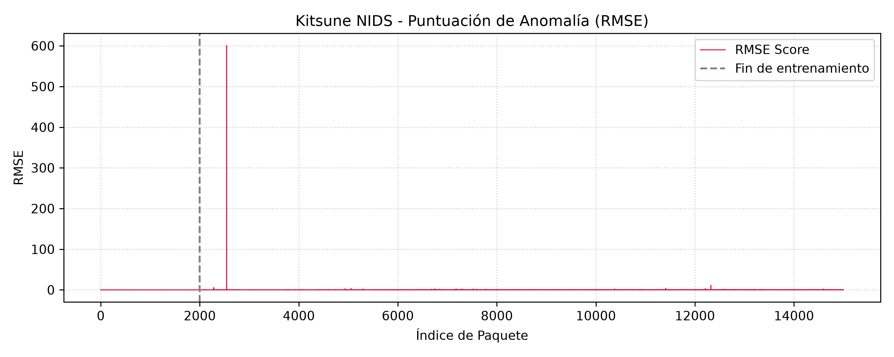

# Kitsune NIDS (Python 3 Modernized)

A modern, reproducible, and educational CLI-first implementation of **Kitsune**, an ensemble of autoencoders for online, unsupervised network anomaly detection.

Based on the original research paper:

> Y. Mirsky, T. Doitshman, Y. Elovici, and A. Shabtai, "Kitsune: An Ensemble of Autoencoders for Online Network Intrusion Detection", NDSS 2018.

## Purpose & Positioning

This project is not designed to compete with high-throughput production engines like Suricata or Zeek. Instead, it solves a fundamental issue in the original academic release: reproducibility and ease of use.

* Zero-friction CLI: Analyze network captures with clean commands instead of editing raw scripts.
* Modern Python: Updated and tested on Python 3.9+ environments with standardized pyproject.toml packaging.
* Automated Visualizations & Data Export: Instantly outputs detection metrics (.csv) and anomaly curves (.png).

## Quickstart

### 1. Installation

Clone the repository and install the CLI tool in editable mode:

```bash
git clone https://github.com/kitsune-research/Kitsune-py.git
cd Kitsune-py
pip install -e .
```

Verify that the CLI is available:

```bash
kitsune --help
```

### 2. Run the Built-in Demo

Run the end-to-end anomaly detection pipeline on sample network traffic:

```bash
kitsune demo --limit 15000
```

This processes the traffic through the AfterImage feature extractor, maps 100 features into localized autoencoders via KitNET, and outputs:

* demo_scores.csv: Packet-by-packet RMSE anomaly scores.
* demo_plot.png: Anomaly visualization curve.

## Detection Output Example

The plot below illustrates an end-to-end execution on sample Mirai botnet traffic (kitsune demo):



* Packets 0 – 2,000: Model grace period (Feature Mapping & Autoencoder baseline training).
* Packets 2,000+: Active detection mode. The spike at packet ~2,500 indicates an anomalous traffic pattern exceeding the learned network baseline.

## Usage

### Analyze Custom PCAP / TSV Traces

```bash
kitsune run path/to/traffic.pcap --limit 50000 --csv scores.csv --plot detection.png
```

### Key CLI Parameters

* file (Required)
  Path to .pcap or .tsv network traffic trace.

* --limit [default: 100000]
  Maximum number of packets to process.

* --max-ae [default: 10]
  Maximum size per autoencoder in the KitNET ensemble layer.

* --fm-grace [default: 5000]
  Feature mapping grace period (clustering and feature assignment phase).

* --ad-grace [default: 50000]
  Anomaly detector grace period (normal traffic baseline training phase).

* --csv [default: anomaly_scores.csv]
  Output path to export raw RMSE anomaly scores.

* --plot [default: anomaly_plot.png]
  Output path to generate the anomaly detection curve graph.

## Architecture Overview

Kitsune operates through a lightweight, multi-stage pipeline:

1. Packet Parsing: Packets are ingested via Scapy or pre-extracted TSV streams.
2. AfterImage Feature Extraction: Maintains decaying 2D statistics across 5 temporal windows ($100\text{ms}$ to $1\text{min}$) to produce a 100-dimensional vector.
3. Feature Mapper: Clusters correlated network metrics dynamically.
4. Ensemble of Autoencoders (KitNET): Trains localized sub-autoencoders on benign baseline traffic and routes reconstructive error through an output autoencoder to produce the final RMSE score.

## License

This modernized project is released under the MIT License (see LICENSE).